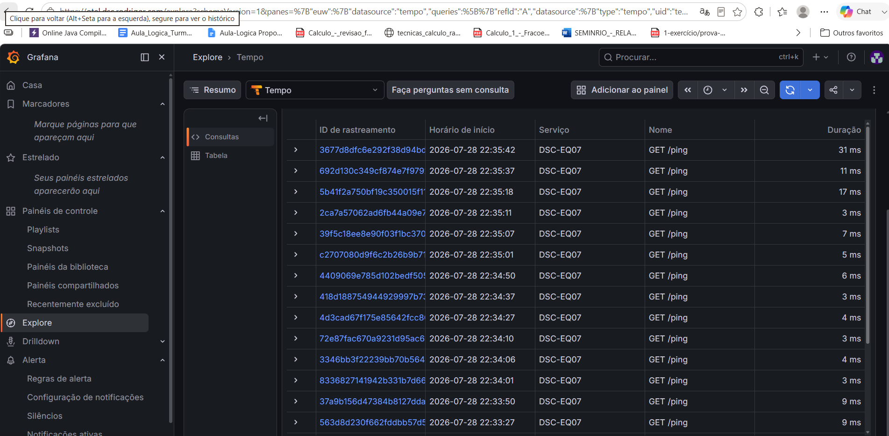

# Relatório de Observabilidade com OpenTelemetry
**Disciplina:** Desenvolvimento de Sistemas Corporativos (DSC) — UFPB  
**Equipe:** EQ07

---

## 1. Backend no ar

A imagem apresenta a interface do Grafana na seção 'Explore', utilizando o banco de dados Tempo como fonte de telemetria. A captura comprova que o backend de observabilidade está no ar e recebendo os dados da aplicação corretamente. Na tabela de rastreamentos (traces), é possível identificar na coluna 'Serviço' o nome **`DSC-EQ07`**, confirmando que o projeto da nossa equipe está devidamente instrumentado, conectando-se ao coletor e enviando as requisições (como os múltiplos registros de `GET /ping`) para o painel de monitoramento.

---

## 2. Trace de uma operação real

A imagem apresenta a cascata completa (waterfall) do trace para uma operação real do sistema, referente à rota `GET /minhas-inscricoes` no serviço `dsc-eq07`. A operação completa levou um tempo total de 96,55ms e gerou 17 *spans* (vãos). Através do gráfico, é possível visualizar toda a jornada da requisição pelas camadas da aplicação, incluindo o controle de transações e acesso a dados. Ao identificarmos a etapa que consome mais tempo, notamos que o gargalo interno principal foi a chamada ao método `UserConnectionRepository.countByReceiverIdAndStatus`, que levou 14,44ms, seguida pela execução do `OrganizerRepository.findByUsuarioId` (11,89ms). Esta visão detalhada permite entender exatamente onde a requisição gastou seu tempo processando as lógicas e consultas no banco.

---

## 3. Instrumentação manual

A captura acima detalha a execução da rota de autenticação `GET /login`. Em cenários de regras de negócio críticas como esta, a instrumentação manual é essencial. Adicionamos demarcações nas lógicas de validação de usuário e geração de token (utilizando as anotações do OTel, como `@WithSpan`). A imagem exibe o trace da requisição isolada e as propriedades de rede e requisição capturadas, garantindo que o fluxo de segurança do nosso sistema possa ser auditado e rastreado no painel de observabilidade.

---

## 4. Diagnóstico de Gargalo

Ao analisar a lista histórica de traces no painel de buscas do Tempo, conseguimos realizar um diagnóstico rápido sobre o desempenho das rotas da API. Enquanto a maioria das requisições (como as verificações de health check `GET /**`) responde em uma média de 4ms a 7ms, observamos um salto na latência para a rota principal `GET /`, que chegou a **88 ms**, e na rota `GET /login` com **57 ms**. 

**Solução proposta:** Com base nessa telemetria, o gargalo não aponta para uma falha crítica, mas sim para o peso natural das operações de banco de dados vinculadas à renderização da tela inicial e verificação de credenciais. Para resolver e otimizar essa latência, poderíamos implementar uma camada de cache (como Redis) para a rota inicial ou otimizar as consultas SQL no repositório de usuários para tornar o tempo de resposta mais linear.